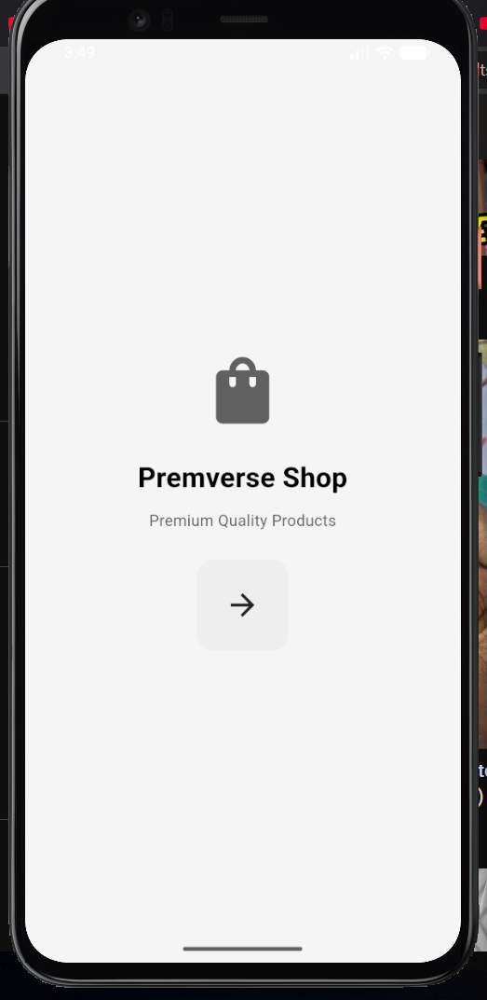
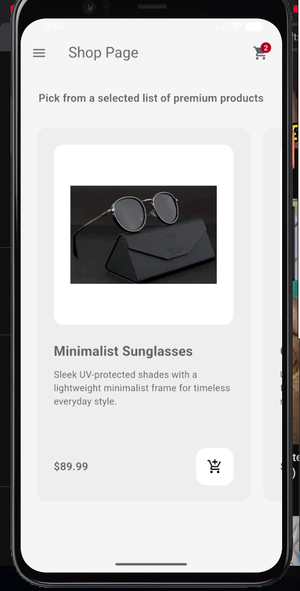
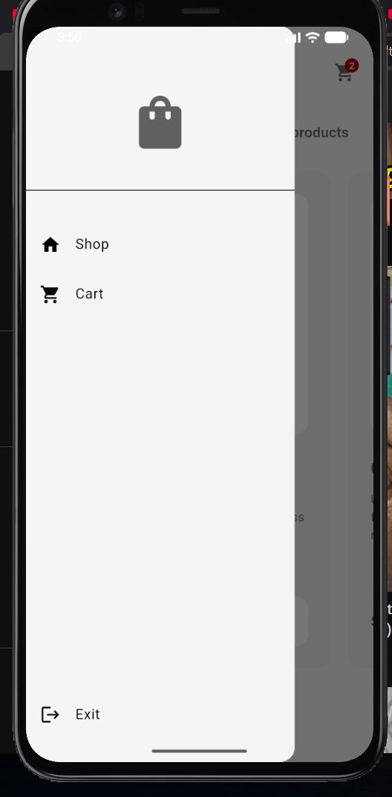
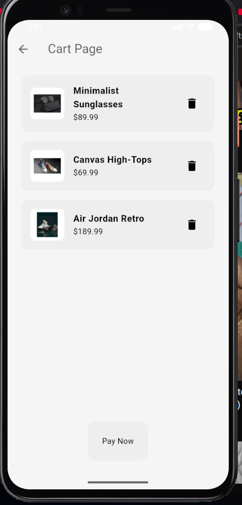

# 🛍️ Premverse Shop

<p align="center">
  
  
  
  
  
</p>

<p align="center">
  A sleek, minimalist e-commerce mobile application built with <b>Flutter</b> and <b>Provider</b> state management. Designed with a clean monochrome aesthetic, smooth micro-interactions, and premium product presentation.
</p>

---

## ✨ Features

- **🎨 Minimalist Design Language**: Curated monochrome color palette, rounded cards, and elegant typography that lets products shine.
- **🏷️ Curated Product Catalog**:
  - Horizontal scrolling product showcase with high-resolution imagery.
  - Detailed product descriptions tailored to each unique piece.
  - Individualized pricing and quick-add actions.
- **🔔 Real-Time Cart Counter Badge**:
  - Upper-right shopping cart icon dynamically reflects the quantity of items in the cart in real time using Material 3 `Badge.count`.
  - Automatically hides when the cart is empty.
- **🛒 Interactive Cart Experience**:
  - View all added items with dedicated product image thumbnails, titles, and formatted prices.
  - Confirmation dialogs for adding and removing items to prevent accidental actions.
  - Informative empty cart state with direct prompts to explore products.
- **📂 Custom Navigation Drawer**:
  - Clean slide-out drawer for seamless switching between Shop, Cart, and Exit.
- **⚡ Reactive State Management**:
  - Built on `Provider` (`ChangeNotifier`) for instantaneous, lag-free UI updates.

---

## 📸 Screenshots

<p align="center">
  <table align="center">
    <tr>
      <td align="center" width="25%">
        <b>✨ Welcome Screen</b><br/><br/>
        < alt="Intro Screen" width="220" />
      </td>
      <td align="center" width="25%">
        <b>🛍️ Shop Catalog</b><br/><br/>
        < alt="Shop Screen" width="220" />
      </td>
      <td align="center" width="25%">
        <b>💬 Add to Cart Modal</b><br/><br/>
        < alt="Drawer" width="220" />
      </td>
      <td align="center" width="25%">
        <b>🛒 Cart & Checkout</b><br/><br/>
        < alt="Cart Screen" width="220" />
      </td>
    </tr>
  </table>
</p>

> 💡 **Tip:** Place your exported device screenshots in the [`screenshots/`](screenshots/) directory (`intro_page.png`, `shop_page.png`, `dialog.png`, `cart_page.png`) to display them directly on GitHub.

---

## 🛠️ Tech Stack & Architecture

- **Framework**: [Flutter](https://flutter.dev) (v3.13+)
- **Language**: [Dart](https://dart.dev)
- **State Management**: [Provider](https://pub.dev/packages/provider) (`ChangeNotifierProvider`, `context.watch`, `context.read`)
- **Icons**: Material Icons & Cupertino Icons
- **Architecture Pattern**: MVVM-lite / Component-driven structure

---

## 📂 Project Structure

```text
lib/
├── components/          # Reusable UI widgets
│   ├── my_button.dart        # Custom styled touch button
│   ├── my_drawer.dart        # Slide-out navigation drawer
│   ├── my_list_tile.dart      # Custom drawer list tile
│   └── my_product_tile.dart   # Horizontal product showcase card
├── images/              # Local image assets
│   ├── airJordan.png
│   ├── converse.png
│   ├── hoodie.png
│   └── sunglass.png
├── models/              # Data models and state stores
│   ├── product.dart          # Product data class
│   └── shop.dart             # Shop state manager (ChangeNotifier)
├── pages/               # Main application screens
│   ├── intro_page.dart       # Welcome landing screen
│   ├── shop_page.dart        # Product catalog screen with badge
│   └── cart_page.dart        # Shopping cart & checkout screen
├── theme/               # Styling & color schemes
│   └── light_mode.dart       # Minimal light theme configuration
└── main.dart            # Application entry point & route definitions
```

---

## 🚀 Getting Started

### Prerequisites

- [Flutter SDK](https://docs.flutter.dev/get-started/install) installed on your machine
- Android Studio / VS Code with Flutter extension
- An Android / iOS emulator or a connected physical device

### Installation & Run

1. **Clone the repository**:
   ```bash
   git clone https://github.com/prem70198/premverse_shop.git
   cd premverse_shop
   ```

2. **Install dependencies**:
   ```bash
   flutter pub get
   ```

3. **Verify project health**:
   ```bash
   flutter analyze
   ```

4. **Run the application**:
   ```bash
   flutter run
   ```

---

## 🤝 Contributing

Contributions, issues, and feature requests are welcome!

1. Fork the Project
2. Create your Feature Branch (`git checkout -b feature/AmazingFeature`)
3. Commit your Changes (`git commit -m 'Add some AmazingFeature'`)
4. Push to the Branch (`git push origin feature/AmazingFeature`)
5. Open a Pull Request

---

## 📄 License

This project is open source and available under the [MIT License](LICENSE).
